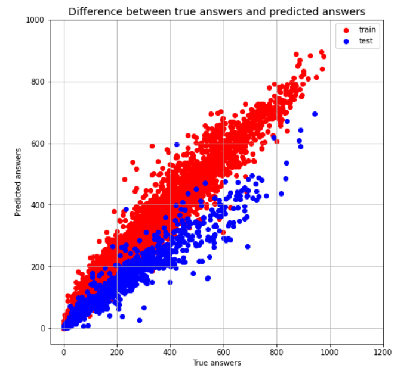

# German-portfolio
My data science portfolio

# [Project 1: Actual trends about Russia in the English-language news: Project Overview](https://github.com/fourthgarage/data-science-and-fried-peaches/tree/actual-trends-about-Russia-in-the-English-language-press)
* In this project I researched English-language news about Russia for the last month and visualized the 50 most mentioned trends using word cloud

# [Project 2: Online school dropout analysis: Project Overview](https://github.com/fourthgarage/data-science-and-fried-peaches/tree/Online-school-dropout-analysis)
* The data set fields are converted to the required type. Fields with a missing age value are removed from the dataset
* A graph of dropout of students has been built depending on the course on which they study
* A graph of dropout of students has been built depending on age
* The hypothesis was tested that children younger than 12 and older than 14 years are more likely to left the course

# [Project 3: Analysis of electronic store sales: Project Overview](https://github.com/fourthgarage/data-science-and-fried-peaches/tree/analysis-of-electronics-store-sales)
* Merged 12 months sales data into one csv-file and answered the questions:
* What's the best selling month? How much profit was this month?
* Which city had the most sales?
* What is the best time to advertise to sell better?
* What are the best selling product combinations?
* What is the best selling product and why?

# [Project 4: Diabetes Prediction: Project Overview](https://github.com/fourthgarage/data-science-and-fried-peaches/tree/diabetes-prediction)
* Loaded Pima Indians Diabetes Database from Kaggle.
* Visualized and analyzed the data, plotted a pairwise dependencies.
* Fitted the model: Implemented a logistic regression algorithm. The error was minimized using gradient descent algorithm.
* Plotted ROC AUC curve, valuated model by precision and recall. Then plotted dependence of precision and recall on the threshold
* Chose a threshold of 0.36 for logistic regression, because the problem is from medical field and I was trying to maximize recall
* AUC = 0.84, Precision = 0.69, Recall = 0.71

# [Project 5: Bike sharing demand](https://github.com/fourthgarage/data-science-and-fried-peaches/tree/bike-sharing-demand)
* Visualized and analyzed the data, plotted a pairwise dependencies.
* Used pipeline, preprocessing before fitting the model
* Mean squared log error on test data = 0.23

# [Project 6: Movie dataset creation](https://github.com/fourthgarage/data-science-and-fried-peaches/tree/movie-dataset-creation)
In this project i scrapped a Disney movies data from wikipedia using BeautifulSoup , cleaned the data, created dataset(csv file). Also created .json and .pickle files
